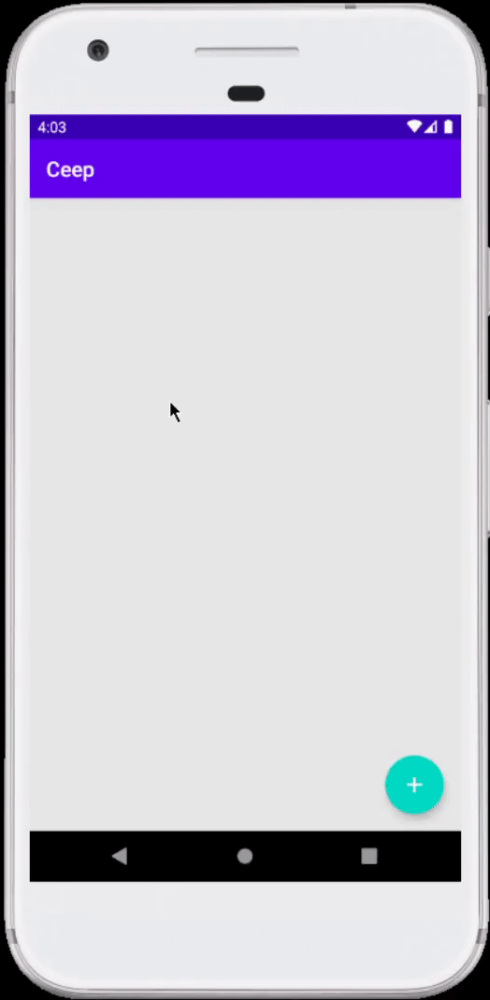

# Bloco de notas com Kotlin

Este aplicativo permite criar, visualizar e gerenciar notas de maneira intuitiva e eficiente. 

## Funcionalidades
Adicionar Notas: Permite que os usuários criem novas notas com título e descrição, utilizando um formulário fácil de preencher.

Alterar Notas: Os usuários podem editar notas existentes, garantindo que as informações estejam sempre atualizadas.

Excluir Notas: Proporciona a opção de remover notas que não são mais necessárias, mantendo a lista organizada.

### Adição de notas

Criação do Formulário: Um formulário foi desenvolvido para facilitar a criação de novas notas para o usúario.

Uso do Floating Action Button (FAB): Um FAB é adicionado para permitir o acesso rápido ao formulário de criação.

### Apresentação de Notas
Tela de Detalhes: Uma tela dedicada permite que os usuários visualizem os detalhes de cada nota, utilizando dados passados por meio de extras (Título e descrição).

Interação com o Menu: O aplicativo possui listeners que permitem a edição e exclusão de notas, oferecendo uma experiência interativa ao usuário (Quando clicado na nota).
