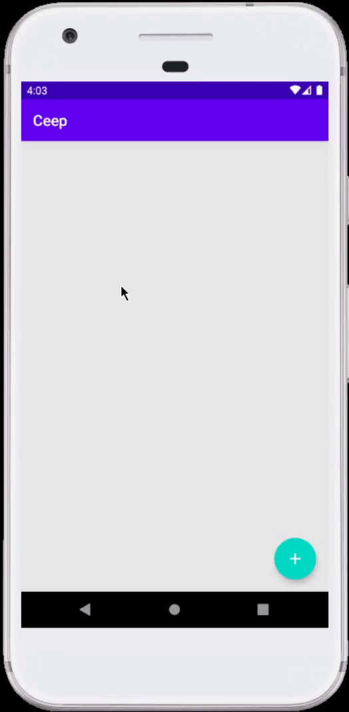
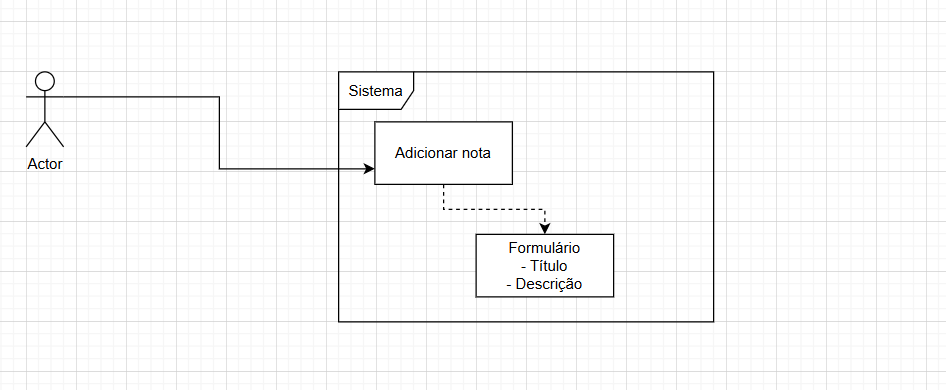
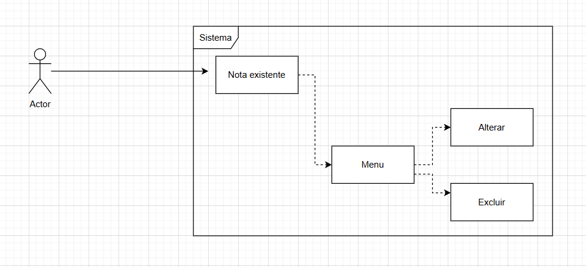
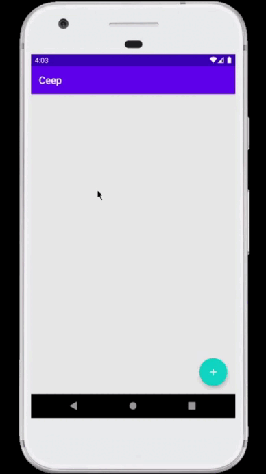
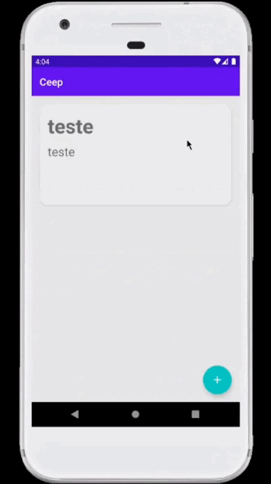

# Bloco de notas com Kotlin

Este aplicativo permite criar e gerenciar notas de maneira intuitiva e eficiente. 

  

# 1 - Plan

## Requisitos Funcionais (RF)

### 1.1. Adicionar Notas
RF001: O sistema deve permitir ao usuário criar novas notas com título e descrição.

RF002: O formulário de criação de notas deve ser fácil de preencher e deve validar que o título e a descrição não estão vazios.

RF003: O aplicativo deve fornecer um botão flutuante (FAB) que redirecione o usuário para o formulário de criação de notas.

### 1.2. Alterar Notas
RF004: O sistema deve permitir ao usuário editar notas existentes.

RF005: O usuário deve ser capaz de acessar a tela de edição ao clicar em uma nota específica.

RF006: A tela de edição deve apresentar o conteúdo atual da nota, permitindo a alteração do título e da descrição.

### 1.3. Excluir Notas
RF007: O sistema deve permitir ao usuário excluir notas existentes.

RF008: O usuário deve ser capaz de acessar a opção de exclusão ao clicar em uma nota específica e selecionar a opção de excluir no menu.

##  Requisitos Não Funcionais (RNF)

### 2.1. Interface do Usuário
RNF001: A interface deve ser intuitiva, facilitando a navegação entre as funcionalidades.

RNF002: O design deve ser responsivo e compatível com diferentes tamanhos de tela.

### 2.2. Desempenho
RNF003: As operações de adição, edição e exclusão de notas devem ocorrer rapidamente, sem causar lentidão no sistema.

### 2.3. Usabilidade
RNF004: O FAB deve estar visível em todas as telas que listam notas para facilitar o acesso rápido à criação de novas notas.

##  Requisitos de Sistema (RS)

RS001: O aplicativo deve ser desenvolvido utilizando a linguagem Kotlin.

RS002: O aplicativo deve ser compatível com dispositivos Android.

RS003: O armazenamento das notas pode ser local, utilizando banco de dados SQLite ou outro mecanismo de persistência adequado.

##  Arquitetura

  

# 2- Build

## Funcionalidades

Adicionar Notas: Permite que os usuários criem novas notas com título e descrição, utilizando um formulário fácil de preencher.

-  Um formulário foi desenvolvido para a criação das notas para o usúario.

- Uso do Floating Action Button (FAB): Um FAB é adicionado para permitir o acesso rápido ao formulário de criação.

  

  

Alterar e Excluir Notas: Os usuários podem editar notas existentes, garantindo que as informações estejam sempre atualizadas.

- Quando o usuário clica em uma nota existente, ele é levado para a tela daquela nota, onde aparece um menu com duas funcionalidades: editar ou excluir que o usúario pode interagir.

  

 

